# The interface

LocalFlow has two surfaces. The one you use constantly is a small overlay that
appears while you speak. The one you visit occasionally is a settings window.
This document is a tour of both.

Every screenshot here is the real application running on Windows 11, captured at
2560x1528.

---

## Dashboard

The window opens here. It answers one question: is LocalFlow ready, and what has
it been doing.

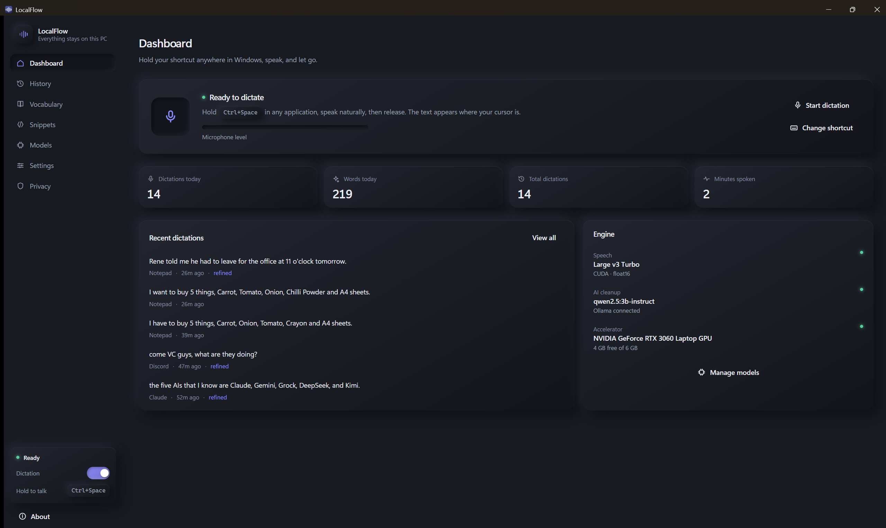

The panel at the top is the only status that matters. It shows the shortcut, a
live microphone level so you can see that audio is arriving before you commit to
a dictation, and a `Start dictation` button for when you would rather click than
hold a key.

Below it are four counters and the recent dictations list. Each entry records
the application it was inserted into, how long ago, and whether the local
language model was involved. Entries marked `refined` went through the cleanup
model; the rest were handled entirely by the deterministic pipeline.

The `Engine` panel on the right is a compact health check:

- **Speech** is the Whisper model, the device it loaded on and the precision.
  `CUDA . float16` means it is on the GPU.
- **AI cleanup** is the Ollama model, and whether Ollama is reachable.
- **Accelerator** is the GPU and its free VRAM. This number matters more than it
  looks: see the VRAM section in [TROUBLESHOOTING.md](TROUBLESHOOTING.md).

### The same screen in the light theme

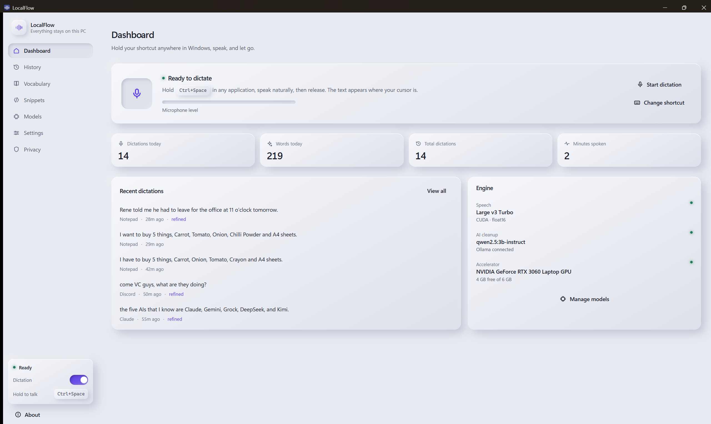

Both themes are built from the same set of tokens. The surfaces are tonal and
the text is not, which is what keeps a soft-shadow interface legible: every text
tone is measured against the card it sits on and clears WCAG AA in both themes.

---

## First run

Setup checks each thing it needs, in the order it needs them, and tells you what
it found rather than assuming.

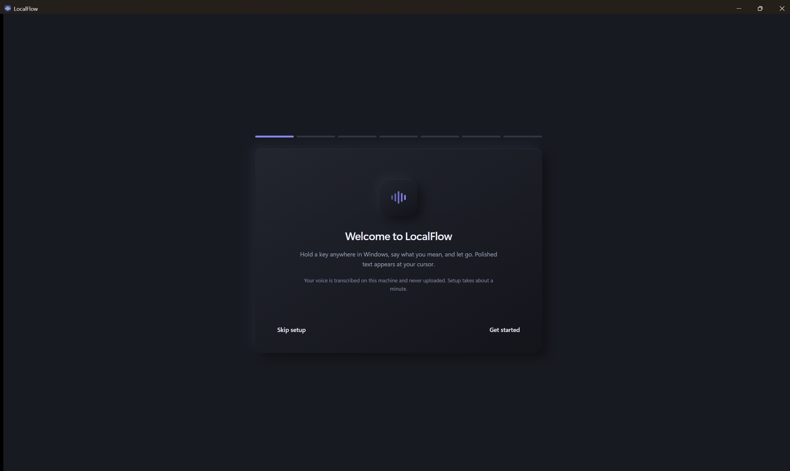

### Microphone

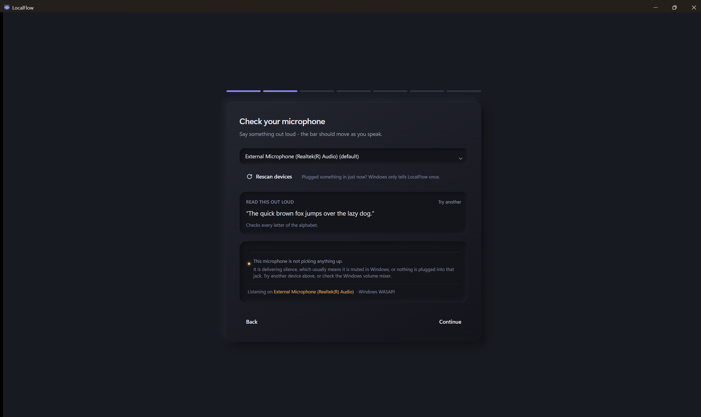

Windows lists the same physical microphone once per audio driver, so a laptop
with two inputs can appear as fifteen devices. LocalFlow collapses that to one
entry per real microphone. The full list is still available in
`Settings > Audio` behind a toggle.

Three things on this screen are worth knowing about:

- **Read this out loud** gives you a sentence to say. Each one exercises
  something the pipeline has to get right: a spoken number, an address that must
  be preserved verbatim, a question that has to end in a question mark. `Try
  another` cycles through them.
- **Listening on** names the device that is actually open, not the one that is
  configured. Those differ more often than you would expect, because a device
  that fails to open falls back to another one.
- If the open device delivers nothing but digital silence for a few seconds, the
  screen says so explicitly instead of leaving a meter at zero with no
  explanation. The screenshot above shows that state.

### Speech model

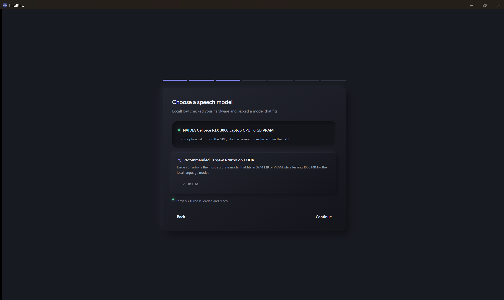

LocalFlow reads your GPU and picks the most accurate model that fits, leaving
headroom for the language model. The reasoning is shown rather than hidden, and
the button reflects reality: it reads `Use this` when the recommendation is not
active, shows a spinner while switching, and becomes a disabled `In use` once
the model is loaded. If a model fails to load, the error appears here.

See [MODEL_SETUP.md](MODEL_SETUP.md) for the measurements behind the
recommendation.

### Shortcut

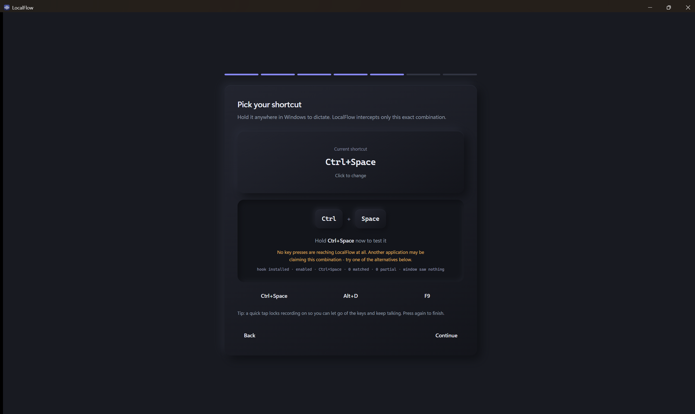

The shortcut is a system-wide low-level keyboard hook, which means it is
invisible: if it does not fire, nothing happens anywhere and there is no error
to read. This screen makes it visible.

Hold the combination and the keycaps press into the surface, an accent glow
blooms behind them and a counter shows how long you have held it. Release and it
reports the duration.

If nothing arrives, it stops guessing and asks the hook what it is seeing. The
diagnostic line under the status reports, in order: whether the hook is
installed, whether it is enabled, the chord it is watching for, how many times
that chord matched, how many times the key arrived without its modifiers, and
whether the window itself saw the keystroke. Those six facts separate the three
distinct failures that all look identical from the outside:

| Reading | Meaning |
|---|---|
| `0 matched`, `0 partial`, `window saw nothing` | Nothing reaches LocalFlow at all. Another application is claiming the combination. |
| `0 matched`, `window saw it` | Keys reach the process but not the hook. Windows has stopped feeding it; restarting reinstalls it. |
| `0 matched`, `N partial` | The key arrives without its modifiers. The chord is wrong. |

### Try it

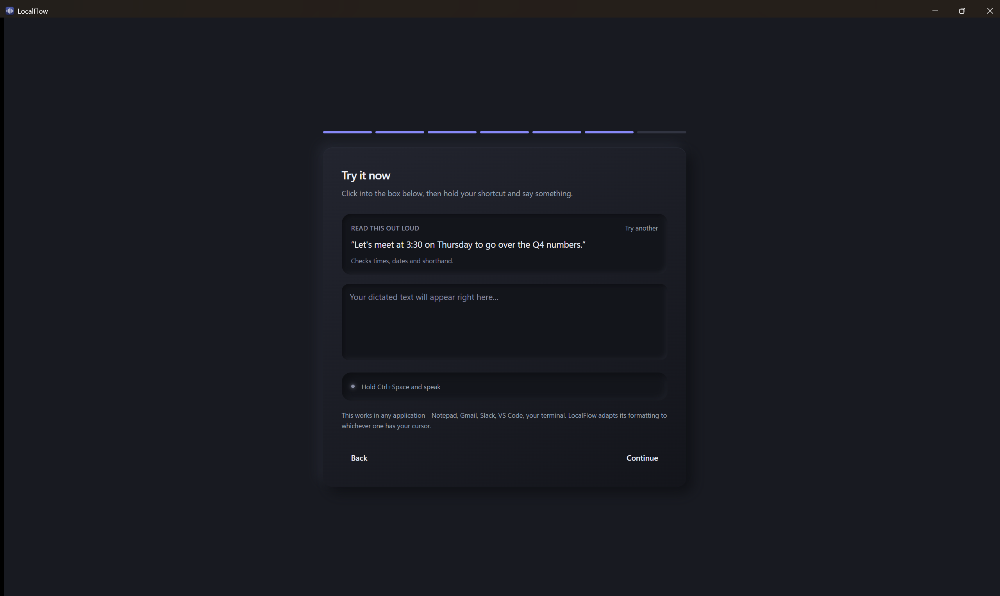

A text box and the same read-aloud prompt. This is the first place the whole
round trip is exercised: hold, speak, release, and watch text arrive.

---

## Models

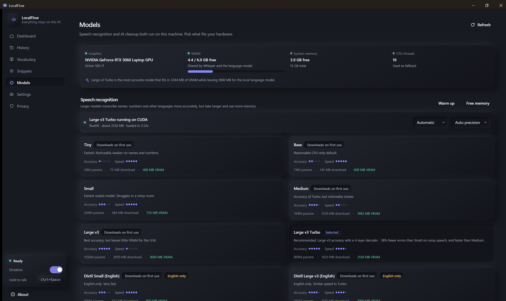

Two model families, managed separately.

**Speech models** are Whisper builds from Hugging Face. The page shows what each
one costs in VRAM and download size, what fits on your hardware, and which is
loaded. Switching downloads on demand and then works offline.

**Language models** come from Ollama. Any model in the Ollama library can be
pulled from here, not only ones already installed. The cleanup model only runs
on dictations the deterministic pipeline cannot resolve on its own, so its speed
matters less than its accuracy, and a model that fits alongside Whisper in VRAM
matters more than either.

---

## Vocabulary

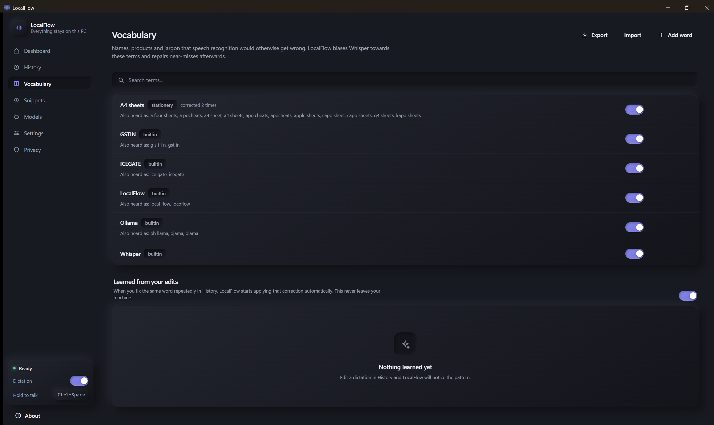

Names, jargon, product codes and acronyms that a general speech model has no
reason to know. Each entry has the correct spelling and a list of what the
recogniser actually produces instead.

That second field is the important one. If Whisper hears `A4 sheets` as
`apocheats`, adding `apocheats` as a sounds-like variant fixes it permanently.
LocalFlow also learns variants from corrections you make to your own dictation
history.

---

## History

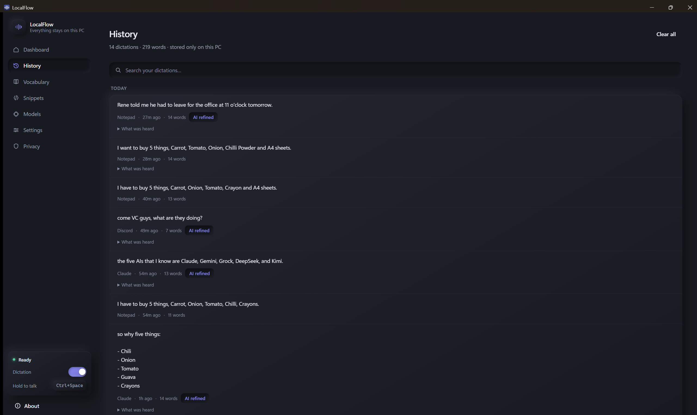

Every dictation, searchable, with the raw transcript alongside the final text so
you can see exactly what the pipeline changed. Editing an entry teaches the
vocabulary system.

History can be disabled entirely, and audio retention is off by default. See
[PRIVACY.md](PRIVACY.md).

---

## Settings

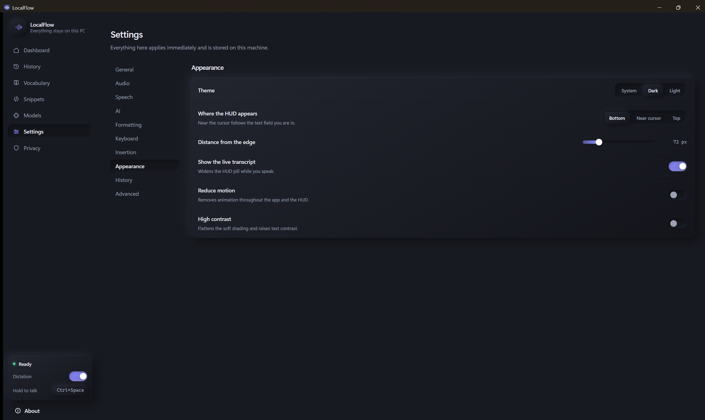

Settings apply immediately and are stored in SQLite on this machine. The
sections are grouped by what they affect rather than by which process implements
them.

`Appearance` carries the theme switch, the HUD position, and two accessibility
options: `Reduce motion` removes animation throughout the application and the
HUD, and `High contrast` flattens the soft shading and raises text contrast.

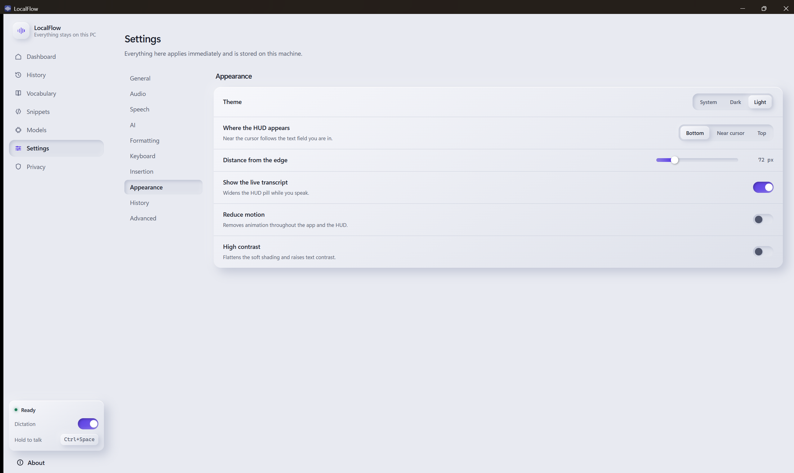

---

## Privacy

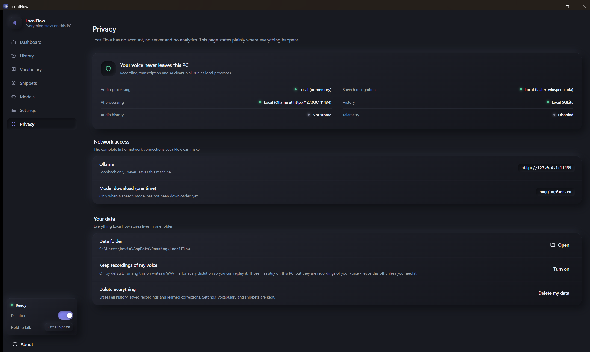

This page exists because a dictation tool that sends audio to a server is a
different product with different risks, and a claim about that is only worth
anything if it can be checked. It lists exactly what is stored, where, and what
touches the network, with controls to export, wipe or disable each part.

The short version: audio stays in memory unless you explicitly turn on
retention, transcription runs locally, the language model runs locally, and
nothing is sent anywhere. The only network access LocalFlow ever makes is
downloading a model when you ask it to.

---

## The HUD

The overlay that appears while you speak is deliberately small: a dark pill near
the bottom of the screen with animated dots that respond to your voice. It is
click-through, so it never intercepts a click meant for the window underneath,
and it grows only when there is something to show, such as a live partial
transcript.

Its position is configurable in `Settings > Appearance`. `Near cursor` follows
the text field you are typing into; `Bottom` and `Top` pin it to the screen.
