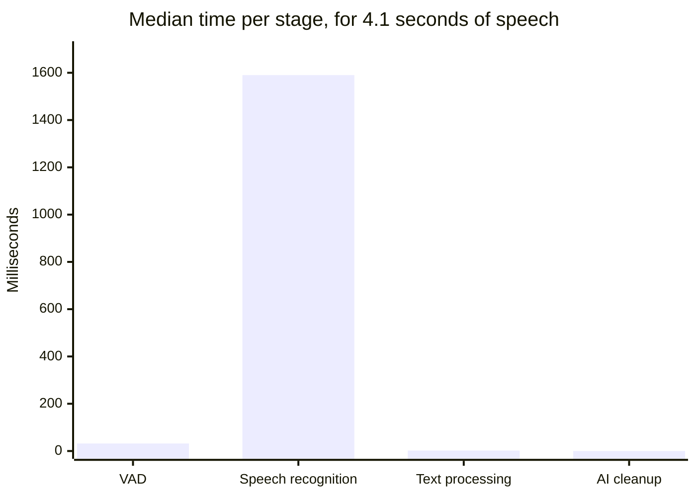
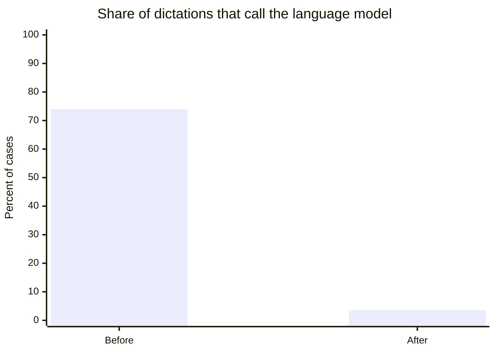
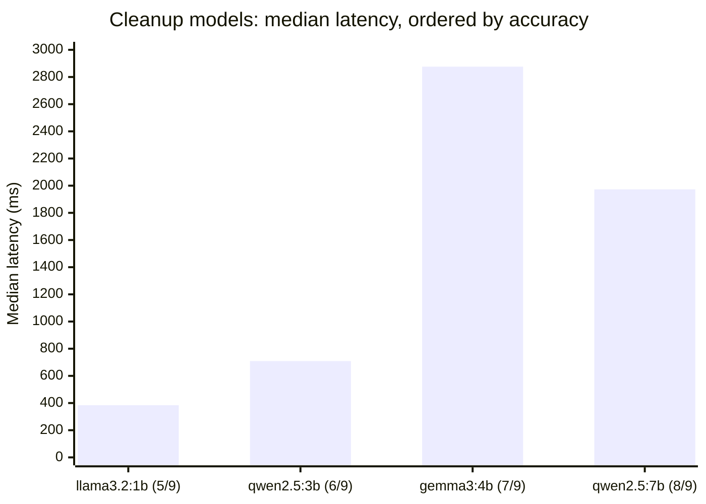

# Performance

Every number here was measured on one machine and is reported with the
conditions attached. Where a measurement contradicted what the change was
supposed to achieve, the measurement is what is written down.

**Reference machine.** Windows 11, NVIDIA GeForce RTX 3060 Laptop GPU (6 GB
VRAM), speech model `large-v3-turbo` on CUDA in float16, cleanup model
`qwen2.5:3b-instruct` through Ollama.

Reproduce with:

```bash
python benchmarks/run_benchmark.py --json results.json
```

Close LocalFlow first. The benchmark loads its own copy of the speech model, and
a second copy on a 6 GB card measures contention rather than the pipeline.

---

## Where the time goes

A dictation is four stages. Only one of them is expensive.



| Stage | Median | What it does |
|---|---:|---|
| Voice activity detection | 32 ms | Trims silence, finds the speech |
| Speech recognition | 1590 ms | Whisper, on the GPU |
| Text processing | 2 ms | Punctuation, corrections, lists, vocabulary |
| AI cleanup | 0 ms | Skipped on 96.4 percent of dictations |
| **Total** | **1619 ms** | for 4.12 s of speech, a real-time factor of 0.35 |

Speech recognition is 98 percent of the cost. Everything the pipeline does after
it is free by comparison, which is the single most useful fact about optimising
this app: work that avoids calling a model is worth far more than work that
makes the rest of the pipeline faster.

---

## The optimisations

### 1. Stop calling the language model when nothing needs it

The deterministic pipeline already handles punctuation, capitalisation, filler
removal, spoken corrections and list structure. The language model was being
invoked anyway, on a rule that amounted to "if the text looks untidy", which is
true of most raw transcripts, including ones the pipeline had just finished
tidying.

The gate now asks a different question: did the deterministic pipeline produce
something that still needs help. Three changes carry most of it.

- Text that already has list structure is never sent. The pipeline built that
  list; handing the result to a language model risks having it flattened back
  into prose.
- A style that rewrites (professional, concise) only invokes the model when
  there is enough text for the rewrite to mean anything. Under twelve words, a
  "professional" rewrite is invention.
- An explicit style override from the user always invokes it. Asking for a
  rewrite is not the same as the pipeline guessing that one is needed.



Measured over the 55-case benchmark: **3.6 percent** of dictations now reach the
language model, against 74 percent before. Each of the other 96.4 percent
finishes in under 3 ms instead of waiting on a model, and the zero-edit rate did
not move. It is 100 percent either way. The model was not earning its latency.

### 2. Give the VRAM back between dictations

Ollama's `keep_alive` decides how long a language model holds GPU memory after
it finishes. It was 15 minutes, which on a 6 GB card meant the cleanup model sat
on memory for a quarter of an hour after a single use.

It is now 30 seconds. That trade is worth stating precisely, because it is not
free:

| Model | Warm call | Cold call | Reload cost | VRAM held |
|---|---:|---:|---:|---:|
| `qwen2.5:3b-instruct` | 604 ms | 2966 ms | 2361 ms | 3468 MB |
| `qwen2.5:7b-instruct` | 1312 ms | 4746 ms | 3434 ms | 5421 MB |

So a 30-second `keep_alive` costs about 2.4 extra seconds on a dictation that
needs cleanup and arrives more than 30 seconds after the previous one. That
applies to 3.6 percent of dictations. The alternative is holding 3.5 GB of a
6 GB card continuously.

**A correction.** This change was made on the theory that a resident language
model slows the speech model down. Measured directly, it does not:

| Resident language model | VRAM in use | Whisper median |
|---|---:|---:|
| none | 3150 MB | 1795 ms |
| `qwen2.5:3b-instruct` | 5567 MB | 1814 ms |
| `qwen2.5:7b-instruct` | 5421 MB | 1710 ms |

Whisper keeps the allocation it already holds, and Ollama spills its own weights
to CPU rather than evicting anything. The cost of oversubscription lands on the
language model, not on the speech model. The change is still right, for a
different reason than the one it was made for: what it protects is everything
else on the machine.

### 3. Never let a partial block a final

Partial transcripts are the live text in the HUD. They are best-effort. The
final transcript is the product.

They share one model and one lock, so a partial in flight could hold the final
behind it. The fix is asymmetric timeouts: a partial waits 50 ms for the lock
and gives up, a final waits 25 seconds. A `_final_pending` flag is set the
moment a final is wanted, and no new partial starts while it is set. A partial
already inside CTranslate2 cannot be interrupted, so the only available lever is
to stop starting more of them.

### 4. Beam size, measured and left alone

Reducing the final beam size from 5 to 1 was expected to save 200 to 400 ms.
Measured, it saved **73 ms** on a typical utterance, at a real cost in accuracy
on exactly the inputs that are hardest to transcribe.

It was left at 5. Partials already use beam size 1, where the trade runs the
other way: they are overwritten by the final, so accuracy does not matter and
latency is the entire point.

This one is on the list because "we tried it and it was not worth it" is a
result, and because a 73 ms saving would have been quietly banked as the
estimated 300 ms if nobody had measured it.

---

## Choosing the cleanup model

Nine cases covering the ways a cleanup model goes wrong: inventing an answer to
a dictated question, failing to apply a spoken correction, not splitting a
run-on sentence, adding content that was never said, mangling technical terms,
changing numbers, breaking a multilingual sentence, and leaving fillers in.

| Model | Passed | Median | VRAM |
|---|---:|---:|---:|
| `qwen2.5:7b-instruct` | 8/9 | 1973 ms | 2088 MB |
| `gemma3:4b-it-q4_K_M` | 7/9 | 2876 ms | 2123 MB |
| `qwen2.5:3b-instruct` | 6/9 | 709 ms | 2157 MB |
| `llama3.2:1b` | 5/9 | 384 ms | 2104 MB |



Accuracy rises left to right; latency does not follow it. `gemma3:4b` is both
slower and less accurate than `qwen2.5:7b`, which is the useful shape here:
picking the bigger model is not automatically the slower choice.

**The default is `qwen2.5:3b-instruct`.** Not because it is the most accurate,
which it is not, but because the gate means it runs on 3.6 percent of
dictations, and on a 6 GB card the 7B model spills to CPU and becomes the
slowest thing in the app. With 8 GB or more, `qwen2.5:7b-instruct` is the better
choice, and the Models page will switch to it.

---

## Quality

55 text cases and 11 spoken fixtures, in `benchmarks/cases.json` and
`tests/fixtures/audio/`.

| Metric | Result |
|---|---|
| Zero-edit rate | 55/55 (100 percent) |
| Word error rate | 2.84 percent mean |
| Language model invocation | 3.6 percent of cases |
| Deterministic path latency | 0.8 ms median |
| End to end, 4.1 s of speech | 1619 ms median |

The zero-edit rate is the headline: how often the output can be used without
touching it. It is also the number most easily gamed by writing lenient cases,
so the cases are in the repository and the failures they were built from are
described in [TESTING.md](TESTING.md).

Word error rate is measured on the speech stage alone, over eleven recordings
made on the reference machine's own microphone. Eleven clips is a small sample
and they are all one speaker: treat 2.84 percent as evidence that the model is
loaded and running on the GPU, not as a claim about anyone else's accent.
